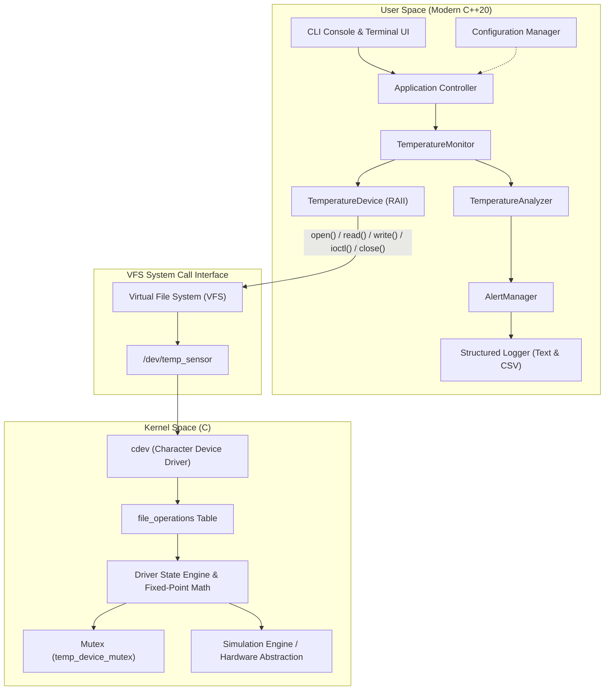
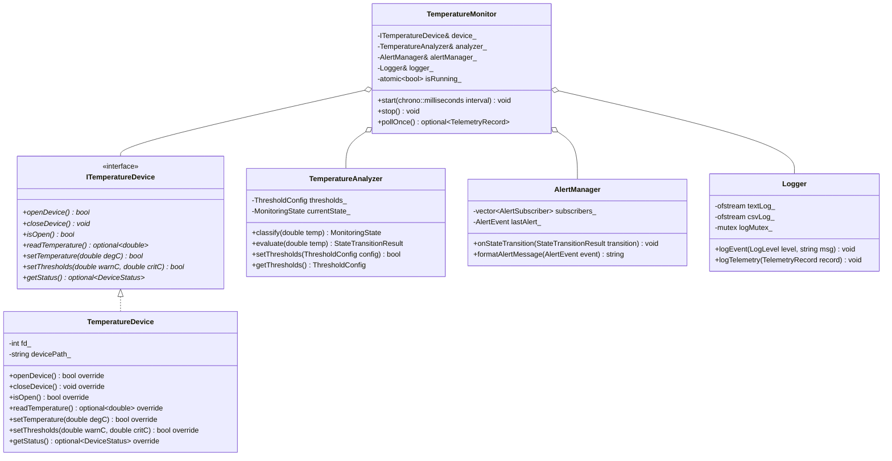
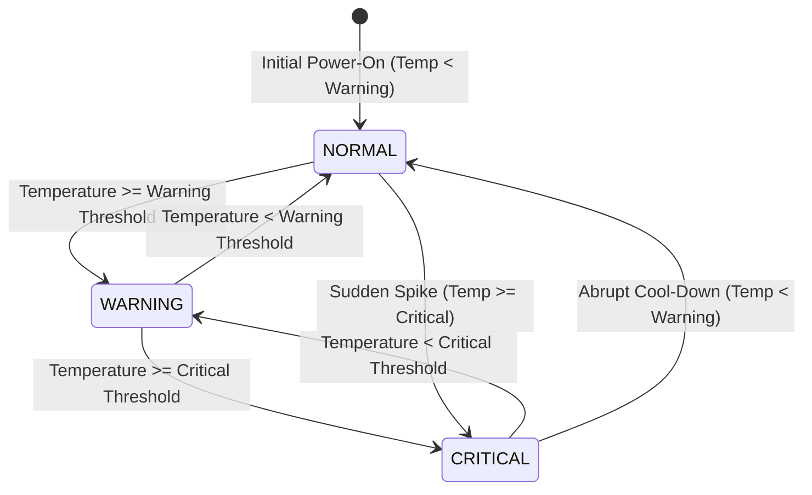

# 3. System Architecture & Design: LTempGuard

## 3.1 High-Level Architectural Overview

LTempGuard adheres to a strict layered architecture dividing responsibilities between Linux Kernel Space (C device driver) and Linux User Space (Modern C++ application).



---

## 3.2 Kernel-Space Architecture (`driver/temp_driver.c`)

The kernel module is a standard Linux Character Device Driver designed for thread safety, reentrancy, and strict validation of user-space data.

### 3.2.1 Core Kernel Structures & Registration Flow
1. **Dynamic Character Device Allocation**:
   `alloc_chrdev_region(&dev_number, 0, 1, "temp_sensor")` allocates an unused Major number.
2. **Device Class Creation**:
   `class_create("temp_sensor_class")` creates `/sys/class/temp_sensor_class/`.
3. **Automatic Device Node Spawning**:
   `device_create(temp_class, NULL, dev_number, NULL, "temp_sensor")` registers the device node with `devtmpfs`, automatically populating `/dev/temp_sensor`.
4. **VFS File Operations Binding**:
   The `cdev` structure links the major/minor number with the `struct file_operations`:

```c
static const struct file_operations temp_fops = {
    .owner          = THIS_MODULE,
    .open           = temp_driver_open,
    .release        = temp_driver_release,
    .read           = temp_driver_read,
    .write          = temp_driver_write,
    .unlocked_ioctl = temp_driver_ioctl,
};
```

### 3.2.2 State Model & Fixed-Point Math
Floating-point arithmetic in the Linux kernel is prohibited to avoid clobbering user-space FPU/SIMD/AVX registers. The driver internally maintains temperatures in integer **millicelsius** ($\text{m}^\circ\text{C}$):

$$\text{Temperature in m}^\circ\text{C} = \text{Degrees Celsius} \times 1000$$

Example: $37.5^\circ\text{C} \implies 37500\text{ m}^\circ\text{C}$.

```c
struct temp_driver_state {
    int32_t current_temp_mC;          /* Current sensor reading in millicelsius */
    int32_t warning_threshold_mC;     /* Warning threshold in millicelsius */
    int32_t critical_threshold_mC;    /* Critical threshold in millicelsius */
    uint32_t read_count;              /* Telemetry: cumulative read syscalls */
    uint32_t write_count;             /* Telemetry: cumulative write syscalls */
    uint32_t ioctl_count;             /* Telemetry: cumulative ioctl syscalls */
    ktime_t last_update_time;         /* Timestamp of last write/update */
    struct mutex lock;                /* Concurrency control mutex */
};
```

---

## 3.3 Shared Kernel-User ABI (`temp_ioctl.h`)

User space and kernel space exchange binary configuration and telemetry via the `ioctl` subsystem using standard Linux ioctl encoding macros (`_IO`, `_IOR`, `_IOW`, `_IOWR`).

```c
#ifndef LTEMPGUARD_TEMP_IOCTL_H
#define LTEMPGUARD_TEMP_IOCTL_H

#include <linux/ioctl.h>
#include <linux/types.h>

#define TEMP_IOC_MAGIC 'T'

struct temp_status_payload {
    __s32 current_temp_mC;
    __s32 warning_threshold_mC;
    __s32 critical_threshold_mC;
    __u32 read_count;
    __u32 write_count;
    __u32 ioctl_count;
    __u64 last_update_ns;
};

struct temp_config_payload {
    __s32 warning_threshold_mC;
    __s32 critical_threshold_mC;
};

/* IOCTL Command Definitions */
#define TEMP_IOC_GET_TEMP     _IOR(TEMP_IOC_MAGIC,  1, __s32)
#define TEMP_IOC_SET_TEMP     _IOW(TEMP_IOC_MAGIC,  2, __s32)
#define TEMP_IOC_GET_STATUS   _IOR(TEMP_IOC_MAGIC,  3, struct temp_status_payload)
#define TEMP_IOC_GET_CONFIG   _IOR(TEMP_IOC_MAGIC,  4, struct temp_config_payload)
#define TEMP_IOC_SET_CONFIG   _IOW(TEMP_IOC_MAGIC,  5, struct temp_config_payload)
#define TEMP_IOC_RESET_STATS  _IO(TEMP_IOC_MAGIC,   6)

#endif // LTEMPGUARD_TEMP_IOCTL_H
```

---

## 3.4 User-Space Architecture (`src/`)

The C++20 user-space application is organized into decoupled domain modules following SOLID principles:



---

## 3.5 State Machine & Transition Behavior

The temperature state machine prevents alert spamming by executing transitions strictly when crossing boundaries:



### Transition Matrix & Deduplication Strategy
1. **Steady State**: When consecutive readings remain within the active state boundary (e.g. $42.0^\circ\text{C} \to 43.1^\circ\text{C}$ while both in `WARNING`), no redundant alert is raised.
2. **Edge Trigger**: When the reading crosses $T_\text{warning}$ or $T_\text{critical}$, an `AlertEvent` is generated with previous state, new state, delta, and timestamp.
3. **Hysteresis / Sanity Check**: Out-of-bounds readings ($T < -50^\circ\text{C}$ or $T > +150^\circ\text{C}$) are flagged as `SENSOR_FAULT` and do not alter the validated operational state.

---

## 3.6 Sequence Diagram: Monitoring Loop & Event Processing

```mermaid
sequenceDiagram
    autonumber
    actor Operator
    participant Mon as TemperatureMonitor
    participant Dev as TemperatureDevice
    participant VFS as /dev/temp_sensor (Kernel Driver)
    participant Ana as TemperatureAnalyzer
    participant Alt as AlertManager
    participant Log as Logger
    participant UI as CLI Dashboard

    Operator->>Mon: startMonitoring(interval = 1000ms)
    loop Every 1000ms
        Mon->>Dev: readTemperature()
        Dev->>VFS: read(fd, buf, size)
        VFS-->>Dev: "42.5\n" (copy_to_user)
        Dev-->>Mon: optional<double>(42.5)
        Mon->>Ana: evaluate(42.5)
        Ana-->>Mon: StateTransitionResult (NORMAL -> WARNING)
        alt State Changed
            Mon->>Alt: onStateTransition(transition)
            Alt->>Log: logTelemetry(transition)
            Alt->>UI: renderAlertBanner(transition)
        else State Unchanged
            Mon->>Log: logHeartbeat(42.5, WARNING)
        end
        Mon->>UI: updateTelemetry(42.5, WARNING)
    end
```

---

## 3.7 Error Handling Architecture

| Failure Condition | Detection Point | Handling Strategy |
| :--- | :--- | :--- |
| **Driver Not Loaded** | `TemperatureDevice::openDevice()` | Returns `false`; logs descriptive diagnostic: `ERROR: /dev/temp_sensor not found. Please run sudo make load.` |
| **Permission Denied** | `open()` returns `EACCES` | Returns `false`; alerts operator to run `chmod 666 /dev/temp_sensor` or execute via `sudo`. |
| **Hardware Removal / Driver rmmod** | `read()` returns `-1` (`ENODEV`/`EBADF`) | Monitor catches broken descriptor, sets state to `DEVICE_OFFLINE`, suppresses false alerts, and initiates periodic reconnection retries. |
| **Malformed Injection String** | `write()` parsing in kernel | Driver rejects invalid string with `-EINVAL`; device state remains unchanged. |
| **Threshold Inversion ($T_\text{warn} \ge T_\text{crit}$)** | `TemperatureAnalyzer::setThresholds()` | Validation fails with descriptive error; existing valid thresholds are retained. |
| **Log Disk Saturation** | `Logger::logEvent()` | Exception isolation prevents application crashes; falls back to standard error (`stderr`). |
